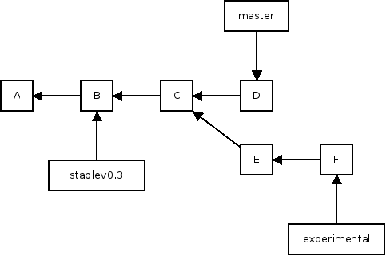

branching
=========

---

# branching

* create a branch to try out an idea, commit a few times, switch back to where you branched from, work there a while, returning to your experiment at your leisure

* have a branch that only ever contains production code, along with separate development and feature branches

* delete feature branches when they are merged into the master branch

---
# starting with branches

get a branch

	!bash
	$ git checkout branchname

create a new branch with name branchname

	!bash
	$ git checkout -b branchname
	#or
	git branch branchname
	git checkout branchname

---

# working with branches

push one of your branches up to a remote

	!bash
	$ git push origin testfeature:experimental
	# git push <name of remote> <local branch name>:<remote name>

it's trivial to pull in the remotes of other collaborators

	!bash
	# checkout the branch "grill" from rick (a remote) and call it "bacon"
	$ git checkout --track -b bacon rick/grill
	# a common one you'll use is this:
	$ git checkout -t origin/feature

to display all local branches

	!bash
	$ git branch
		  master
		* newgitseminar
		  truncatehtml
		  vanilla_960

