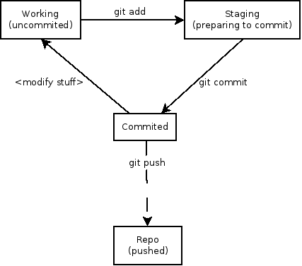

Git for Python Projects
=========

---

# Git
* distributed (redundant)
* flexibile
* network independent
* used on the kernel project
* works on planes, trains, and automobiles

---

# a commit is...
* a snapshot
* referred to by MD5 checksums
* has a description

---

# a branch is...
* a pointer
* a name pointed at a specific MD5 checksum (commit)

---

# a blob is...
* a file
* referred to by its checksum
* name is just an attribute (moving a file doesn't change the checksum)

---

# basic workflow #
1. ### make some changes
1. ### stage snapshots of files
1. ### commit
1. ### (eventually) push

---

# three (or four) stages of Git #

